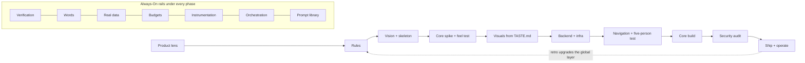

## The Pipeline
<!-- origin: added -->

| Phase | Origin | Purpose | Output |
|---|---|---|---|
| Product-First Doctrine | added | Person, job and moment of value, decided before any tech, with evidence | Five decisions; the UX contract as assertions |
| P0 · Constitution | yours | Standing rules and memory that multiply every prompt | Global + project rules, lanes, context log, hooks |
| Expertise Injection | yours | "The guy who made JS": load judgment, not a job title | Expert library, `inventor-critic` |
| P1 · Vision & Skeleton | yours | A vision precise enough that two agents build the same product | `PRODUCT.md`, `SKELETON.md` |
| Living Checklist | yours | Your plan as core fragments with provable done-whens: vibe freely, revisit the list any time | `CHECKLIST.md`, `/listrevisit` |
| P2 · Core Spike | moved | Optional: prove a fragment early only when it can be proven on its own | Verdict with numbers, core contract, feel test with 3 people |
| P3 · Visual Language | yours | Your taste, not the average's, locked as code | `TASTE.md` (once), `DESIGN.md`, tokens, `/specimen`, audits |
| P4 · Backend & Infra | yours | Boring, strong, host-ready from commit one | `ARCHITECTURE.md`, schema, contract or sync engine, env |
| P5 · Navigation & Flows | yours | Nouns as navigation, state in the URL, clickable shell | `ROUTES.md`, clickable skeleton, Five-Person Test |
| Taming Complexity | added | The system carries complexity; the user only on request | `COMPLEXITY.md`, audit ritual |
| P6 · Core Build & Iteration | yours | The core as small, fenced, verified slices | Flagged slices, CR log, baselines, evals |
| P7 · Security Hardening | moved | Audit controls built in since day one | `SECURITY.md`, red-team findings |
| P8 · Ship & Operate | added | Hosted is not shipped | Launch checklist, landing as demo, runbook, retro |
| Always-On (8 rails) | added | Verification, words, data, budgets, instrumentation, orchestration, prompts, revisits | Hooks, audits, evals, `VOICE.md`, seeds, `BUDGETS.md`, commands, `/reassess`, `/commentrevisit`, `/glossaryrevisit` |

This is not a waterfall. P1 and P2 form one loop. P4 and P5 run in parallel once the mock server exists. P6 loops dozens of times, and P7 only audits controls that P0, P4 and P6 already built. The Always-On rails run under every phase from the first commit. The Doctrine and Taming Complexity are lenses applied at every phase gate: an output that can't name the person, job and moment it serves isn't done. Two gates use real people, because every other judge in the system is a model or you: 3 target people try the feel prototype after P2, and 5 do the core job on the clickable skeleton after P5. The tier sets how deep you go (The Portable Kit, scaling).

