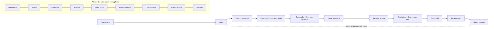

## The Pipeline

The method runs in one order: the product lens, rules, plan, look and feel, backend, navigation, the core built in fragments, security, ship. Each phase has its own guide, and each one leaves something behind in `.offthemode/` or in the code.

| Phase | Purpose | Output |
|---|---|---|
| Product-First Doctrine | Person, job and moment of value, decided before any tech, with evidence | Five decisions in PRODUCT.md; the experience promises as script checks |
| P0 · Constitution | Standing rules and memory that make every prompt stronger | RULES.md, STATE.md, DECISIONS.md, loaded by your tool at every session start |
| Expertise Injection | Load the judgment of the people who invented the tools, not a job title | Expert judgment written into RULES.md; reviews by a second, fresh AI session |
| P1 · Vision & Skeleton | A vision precise enough that two AI tools would build the same product | PRODUCT.md, SKELETON.md |
| Living Checklist | The plan as core fragments with provable done-whens: work free-form, revisit the list any time | CHECKLIST.md, `listrevisit` |
| P2 · Core Spike | Optional: prove a fragment marked "Verify: early" before building on it, when it can be proven on its own | A verdict with numbers, the core contract, a feel test with 3 people |
| P3 · Visual Language | A real point of view, not the average's, locked in as code | PRODUCT.md §Feeling, DESIGN.md, design tokens, a specimen page, audits |
| P4 · Backend & Infra | Boring, strong and ready to host from the first commit | Schema, API contract or sync engine, environments; choices in DECISIONS.md |
| P5 · Navigation & Flows | Nouns as navigation, state in the URL, a clickable shell | ROUTES.md, a clickable skeleton, the Five-Person Test |
| Taming Complexity | The system carries the complexity; the person sees it only on request | COMPLEXITY.md, a regular audit |
| P6 · Core Build & Iteration | The core built as small, fenced, verified slices | Slices behind flags, baselines, evals, checklist items closed with evidence |
| P7 · Security Hardening | Audit the controls that were built in from day one | SECURITY.md, red-team findings |
| P8 · Ship & Operate | Hosted is not shipped | Launch checklist, landing page as a live demo, runbook, lessons added to RULES.md |
| Always-On rails | Verification, words, real data, budgets, being found, instrumentation, orchestration, prompts, revisits | Check scripts, evals, VOICE.md, seed data, RULES.md §Budgets, the Being Found Audit, prompt templates, `reassess`, `commentrevisit`, `glossaryrevisit` |

This is not a waterfall. P1 and P2 form one loop. P4 and P5 run in parallel once a mock server exists. P6 loops dozens of times, and P7 only audits controls that RULES.md §Safety, P4 and P6 already built. The Always-On rails run under every phase from the first commit.

The Doctrine and Taming Complexity are lenses, applied at every phase gate: an output that cannot name the person, job and moment it serves is not done. Two gates use real people, because every other judge in the method is a model or you: 3 target people try the feel prototype after P2, and 5 do the core job on the clickable skeleton after P5.

Scale the depth to the project. A weekend build goes lighter at each gate than a product with paying users. On an existing project, start at the phase the work is in, and use the earlier phases as checks on what already exists.

