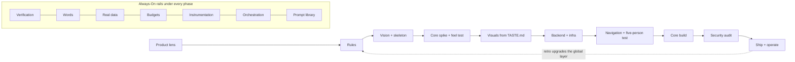

## Where Your Approach Leaks
<!-- origin: added -->

The intent of your order is right: rules first, vision before code, function before polish. It leaks in twelve places. Each fix keeps your phases.

1. **Product is implicit.** Person, job and moment of value are never written down, so the agent fills them with the average product. **Fix:** Product-First Doctrine, written into `.offthemode/PRODUCT.md`.
2. **Nothing checks the work.** "Done" means the agent stopped typing. **Fix:** Always-On · Verification Loop: audits that assert, hooks that gate a `DONE:` claim, `/ship`.
3. **Security is scheduled as a phase but lives in the schema.** Tenancy, authz and where PII lives get decided in backend work either way. **Fix:** invariants in the rules on day one, a threat sketch in P1, and P7 as an audit.
4. **A risky fragment gets built last.** Defining the core concept first, in planning, is right. But the core is built last, so if one fragment needs realtime, a sync engine or a different data shape, everything built before it bends. **Fix:** the Living Checklist splits the core into fragments and marks each one as provable early or only on completion. P2 proves the early ones before the plan depends on them; the rest get an end-to-end check when they are complete. "Plug and play" is only true once the socket is known.
5. **Complexity has no owner.** Every feature arrives with a control. **Fix:** Taming Complexity, where clutter is a counted score that fails like a test.
6. **The "made JS" persona is placebo.** It changes tone, not tradeoffs. **Fix:** Expertise Injection: values, refusals, sources, an adversarial critic.
7. **The content layer is missing.** Visuals judged on lorem ipsum, copy left to defaults. **Fix:** Always-On · Real Data and Words & Voice, before visuals lock.
8. **Corrections evaporate.** **Fix:** the LESSONS promotion ladder (P0) and retros that upgrade the global layer.
9. **Hosted is not shipped.** No launch, no monitoring, no loop from usage back to product. **Fix:** Always-On · Instrumentation and P8.
10. **One agent in one context does everything, including reviewing itself.** **Fix:** Always-On · Agent Orchestration.
11. **Every judge is a model or you.** The predict-my-call test proves a model can predict you; critics score screenshots. Nothing checks that the Person exists or that a stranger reaches the moment of value unaided. **Fix:** an Evidence column in PRODUCT.md and two human gates (P2 feel test, P5 Five-Person Test).
12. **"Unique" is defined against the average, not toward you.** Bans without a positive signature converge on the next mode, and in 2026 that mode is the anti-slop look itself. **Fix:** `TASTE.md` built from your own loves and hates, plus a `USED.md` ledger so project 3 can't look like project 1 (P3).

